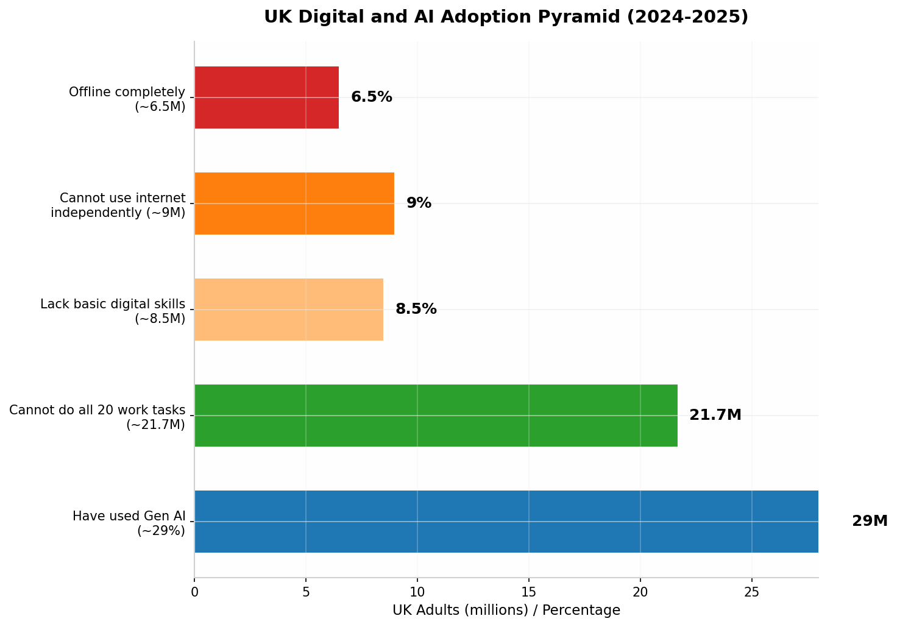
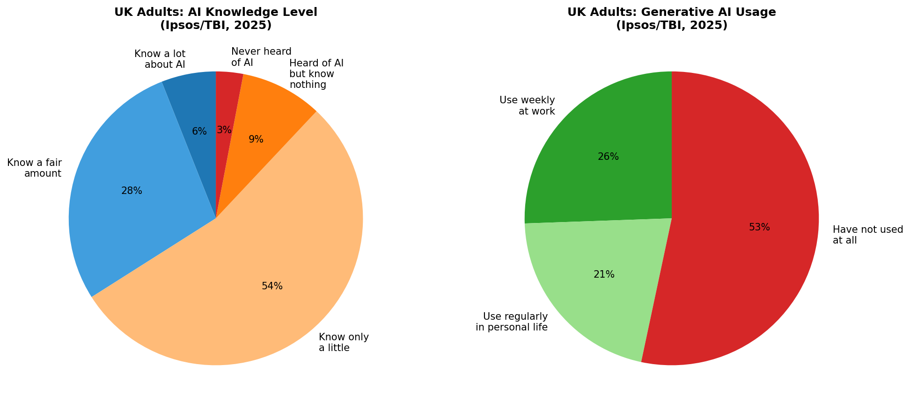
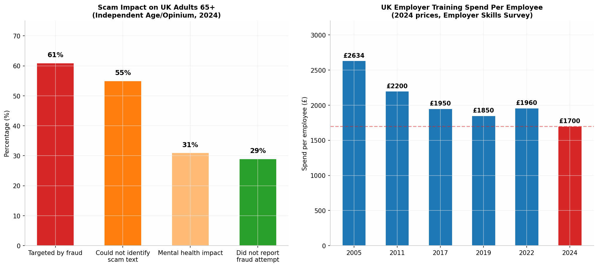

# UK AI Inclusion Feasibility Research: Should You Build a Business Around AI Onboarding for Low-Digital-Confidence Adults?

**Research Date:** 16 June 2026  
**Geographic Scope:** United Kingdom (England-primary, Scotland/Wales/Northern Ireland-secondary)  
**Research Rounds:** 12+ iterative searches across digital exclusion, AI adoption, policy, competitors, spending, and institutional programs  
**Sources:** 60+ cited from ONS, Ofcom, Lloyds Bank, Ipsos, Good Things Foundation, Age UK, UK Finance, FutureDotNow, government publications, academic research, industry reports

---

## 1. Executive Verdict

### 1.1 The Direct Answer

**Yes — this demographic is worth building around, but not through direct-to-consumer AI education.** The strongest wedge is **B2B2C: selling trusted, practical digital confidence programs to institutions (employers, councils, libraries, charities, housing associations) who then deliver them free to end users.** The product should almost certainly **avoid the word "AI" in first contact** and instead lead with **life admin, scam safety, phone confidence, or job help** — AI capability should be the hidden engine, not the marquee feature.

### 1.2 The Core Insight

The research reveals a paradox: **millions of UK adults are being left behind by AI precisely because they struggle with digital basics**, yet they do not wake up wanting "AI training." Bruce's wife — uninterested in AI, app-averse, but potentially receptive if introduced properly — is the archetype. The business opportunity lies not in teaching AI but in **solving practical problems (forms, scams, banking, health apps, job applications) using AI as a behind-the-scenes tool**, delivered through trusted human intermediaries in familiar community settings.

The economic case is compelling: closing the UK's essential digital skills gap would unlock **£23.1 billion in annual GVA** and **£9 billion in business profitability** [(FutureDotNow)](https://futuredotnow.uk/lack-of-digital-skills-in-workforce-costing-uk-over-23-billion-per-year/) . Employer training spend totals **£53 billion annually** but is declining and poorly targeted [(People Management)](https://www.peoplemanagement.co.uk/article/1941741/uk-employers-cut-training-investment-lowest-level-decade-research-finds) . Government has committed **£11.9 million** to a Digital Inclusion Innovation Fund [(GOV.UK)](https://www.gov.uk/government/publications/digital-inclusion-action-plan-one-year-on/digital-inclusion-action-plan-one-year-on) . The senior tech services market is growing at **12.9% CAGR in the UK** [(Future Market Insights)](https://www.futuremarketinsights.com/reports/senior-tech-services-market) . Yet **no dominant player** occupies the specific niche of AI-powered practical support for low-digital-confidence adults delivered through institutional partnerships.

### 1.3 Best Wedge

**Primary:** Employer-sponsored "Digital Confidence for Frontline Staff" — a B2B2C workshop and support package sold to employers (retail, hospitality, care, logistics, manufacturing) whose non-office workers lack digital confidence. Employers pay because digital skills gaps cause **work to be passed to other staff** (52% of employers report this) [(People Management)](https://www.peoplemanagement.co.uk/article/1941741/uk-employers-cut-training-investment-lowest-level-decade-research-finds) , and because **59% expect to upskill employees** in the coming year [(People Management)](https://www.peoplemanagement.co.uk/article/1941741/uk-employers-cut-training-investment-lowest-level-decade-research-finds) .

**Secondary Wedge 1:** Family-sponsored support — adult children buying "Phone + Digital Confidence Clinics" for parents, delivered in-person at libraries or community centres. The proxy buyer (family member) has money, motivation, and a credit card.

**Secondary Wedge 2:** Council/charity-contracted digital inclusion programs — winning contracts from local authorities and community organizations to deliver digital confidence sessions as part of their statutory inclusion obligations.

**Top No-Go:** Pure direct-to-consumer subscription app or generic online "AI course." The research consistently shows these users will not self-serve, will not pay, and will not engage with app-based learning.

---

## 2. Market Size and Segmentation

### 2.1 Market Size Estimates

| Metric | Low Estimate | Base Estimate | High Estimate |
|---|---|---|---|
| UK adults with low digital confidence | 8.5 million  [(Good Things Foundation)](https://www.goodthingsfoundation.org/policy-and-research/what-works-colab/basic-digital-skills-briefing)  | 15 million | 21.7 million  [(FutureDotNow)](https://futuredotnow.uk/latest-data-on-essential-digital-skills-reveals-skills-stagnation/)  |
| Adults who have never used generative AI | 35 million (~70%) | 30 million (~60%) | 25 million (~50%) |
| Adults with no/fairly low AI knowledge | 30 million (~65%) | 25 million (~54%) | 20 million (~43%) |
| Reachable through institutional channels | 2 million | 5 million | 10 million |
| Paying customers (sponsors/buyers) | 500 employers + 2,000 families | 2,000 employers + 10,000 families | 5,000 employers + 50,000 families |
| Sponsored users (free to user) | 50,000 | 200,000 | 500,000 |
| Annual revenue potential (Year 3) | £250,000 | £750,000 | £2.5 million |
| First-year realistic revenue (2-person team) | £30,000-£50,000 | £75,000-£120,000 | £200,000+ (requires partnerships) |
| Five-year potential if successful | £500K | £1.5-2M | £5M+ |

**Key assumptions:** England-first launch; Bruce handles sales/partnerships; JC builds tools/workflows; initial delivery is high-touch in-person with pathway to train-the-trainer model; pricing at £150-£500 per employer workshop, £75-£150 per family-sponsored session.

### 2.2 The Digital Exclusion Landscape

The pyramid illustrates the layered nature of digital exclusion in the UK. At the base, approximately **6.5 million UK adults are completely offline** [(UK Parliament)](https://committees.parliament.uk/writtenevidence/22722/html/) . Moving up, **9 million cannot use the internet independently** [(UK Parliament)](https://committees.parliament.uk/writtenevidence/22722/html/) , and **8.5 million lack basic digital skills** with **1.3 million unable to perform any foundation-level tasks** [(Good Things Foundation)](https://www.goodthingsfoundation.org/policy-and-research/what-works-colab/basic-digital-skills-briefing) . At the broadest layer, **21.7 million working-age adults (54% of the workforce) cannot complete all 20 essential digital work tasks** [(FutureDotNow)](https://futuredotnow.uk/latest-data-on-essential-digital-skills-reveals-skills-stagnation/) . Meanwhile, only **29% of UK adults have used generative AI** [(masterofcode.com)](https://masterofcode.com/blog/generative-ai-statistics) , meaning roughly **35 million have not** — this is the total addressable population, though not all are reachable or worth targeting.

The awareness data reveals the scale of the knowledge gap. **Only 34% of UK adults** say they know at least a fair amount about AI, while **54% know only a little** and **12% have either never heard of AI or know nothing about it** [(Tony Blair Institute for Global Change)](https://institute.global/insights/tech-and-digitalisation/what-the-uk-thinks-about-ai-building-public-trust-to-accelerate-adoption) . On usage, nearly **half of UK adults have not used any generative AI tools in the past 12 months** [(Tony Blair Institute for Global Change)](https://institute.global/insights/tech-and-digitalisation/what-the-uk-thinks-about-ai-building-public-trust-to-accelerate-adoption) . Critically, **56% of non-users see AI as a risk to society**, compared to just **26% of regular users** [(Tony Blair Institute for Global Change)](https://institute.global/insights/tech-and-digitalisation/what-the-uk-thinks-about-ai-building-public-trust-to-accelerate-adoption)  — this trust gap is both a barrier and, paradoxically, a market opportunity for trusted human intermediaries.

---

## 3. Segmentation Table: 14 Target Segments

| Segment | Size Estimate | Core Pain | AI Interest | Digital Skill | Buyer | Sponsor | Best Channel | Likely Product | WTP | CAC Est. | Support Burden | Score (1-10) | Avoid? |
|---|---|---|---|---|---|---|---|---|---|---|---|---|---|
| **Older adults 75+ offline** | 1.7M  [(Age UK)](https://www.ageuk.org.uk/siteassets/documents/reports-and-publications/reports-and-briefings/active-communities/internet-use-statistics-june-2024.pdf)  | Isolation, service access, health apps | Very low | None | Family member | Age UK, council, NHS | Library drop-in, GP surgery, church | Phone confidence clinic + tablet loan | Family: £75-150/session | £40-80 (family referral) | Very high (1:1) | 4 | Margins too thin; rely on charity funding |
| **Older adults 65-74 low digital** | 2.3M  [(Age UK)](https://www.ageuk.org.uk/siteassets/documents/reports-and-publications/reports-and-briefings/active-communities/internet-use-statistics-june-2024.pdf)  | Banking, shopping, scams, family contact | Low | Basic only | Family or self | Age UK, council | Library, community centre, Facebook | "Stay Safe Online" + phone help | Family: £75-150; Self: £20-40 | £30-60 | High | 5 | Low WTP; free alternatives exist |
| **Low-income working age** | 4M+  [(Good Things Foundation)](https://www.goodthingsfoundation.org/policy-and-research/what-works-colab/basic-digital-skills-briefing)  | Benefits, job apps, forms, banking | None | Low | Self (limited budget) | DWP, council, charity | Job Centre, library, housing assoc. | Job-seeker digital + AI assistant training | Free to user (sponsored) | £15-30 (outreach) | Medium | 6 | Requires public funding; slow sales cycle |
| **Non-office workers (retail/hospitality/care)** | 8M+  [(FutureDotNow)](https://futuredotnow.uk/latest-data-on-essential-digital-skills-reveals-skills-stagnation/)  | Digital payslips, scheduling, compliance apps | None | Low-Medium | Employer | Employer, union | Employer HR, union rep, team leader | "Digital Confidence at Work" workshop | Employer: £200-500/session | £80-200 (B2B sales) | Low-Medium | **9** | **Strongest wedge: clear buyer, budget, scale** |
| **Small business owners (non-tech)** | 1.5M+  [(kaizenaiconsulting.com)](https://kaizenaiconsulting.com/rise-of-ai-uk-small-business-2025-statistics/)  | Marketing, admin, invoicing, customer service | Low-Medium | Low-Medium | Self | Chamber of Commerce, council | Small biz networks, chambers, Facebook | "AI for Your Business" clinic | £100-300/workshop | £50-100 | Medium | 7 | Price-sensitive; many free alternatives |
| **Job seekers (long-term unemployed)** | 1.3M+ | CVs, applications, interview prep, skills | Low-Medium | Low | Self (free courses) | DWP, job centres, charities | Job Centre Plus, Work Programme | AI-powered job search + CV help | Free to user | £20-40 (partner referral) | Medium | 5 | Commoditized; free provision dominant |
| **Carers (paid and unpaid)** | 5M+  [(GOV.UK)](https://www.gov.uk/government/statistics/participation-survey-2024-25-annual-publication/main-report-for-the-participation-survey-april-2024-to-march-2025)  | Time pressure, form-filling, health apps, isolation | Low | Low-Medium | Self or employer | NHS, council, carer charities | GP surgery, carer support groups, council | "Digital Help for Carers" (forms, apps) | £30-60/session | £25-50 | Medium | 6 | Scattered; hard to reach at scale |
| **People with disabilities** | 14M  [(GOV.UK)](https://www.gov.uk/government/statistics/participation-survey-2024-25-annual-publication/main-report-for-the-participation-survey-april-2024-to-march-2025)  | Accessibility, assistive tech, service access | Low | Variable | Self, family, PA | Council, NHS, disability charities | Disability orgs, social care, OTs | Accessible device setup + AI tools | Family: £75-150 | £40-80 | High (individualized) | 5 | High support burden; safeguarding liability |
| **ESOL/immigrant communities** | 1.5M+ | Language barriers, form-filling, job search, banking | None | Low (language) | Self, family, community org | Council, Home Office, charities | Community centres, mosques, ESOL classes | Multilingual phone help + form assistance | Free to user | £30-60 | Medium-High | 5 | Language complexity; requires specialist partners |
| **Rural communities** | 2M+ | Broadband, service access, isolation, transport | Low | Low-Medium | Self, family | Council, rural charities | Village halls, mobile libraries, parish | Mobile digital clinic (van-based) | £50-100/session | £60-120 | High (travel) | 4 | Travel costs erode margins |
| **Adults in debt/financial hardship** | 3M+ | Budgeting, banking, scams, benefits | None | Low | Self (no money) | Citizens Advice, debt charities, council | Citizens Advice, food banks, credit unions | Scam safety + money management digital help | Free | £15-30 | Medium | 5 | No payment capacity; 100% grant-dependent |
| **Women returning to work** | 1M+ | Confidence, skills gap, childcare, flexible work | Medium | Low-Medium | Self or employer | DWP, councils, women's orgs | Job centres, women's networks, Facebook | "Back to Work Digital Confidence" | £50-100/course | £40-80 | Low-Medium | 6 | Moderate WTP; free alternatives |
| **Housing association residents** | 2M+ | Rent portals, repairs, energy bills, benefits | Low | Low | Housing assoc (bulk) | Housing assoc, council | Housing association offices, community rooms | Tenant digital support program | Housing assoc: £5-15/resident | £10-25 (B2B) | Low (group delivery) | 7 | Volume play; low per-unit revenue |
| **NHS patients (chronic conditions)** | 15M+ | Appointments, prescriptions, health info, forms | Low-Medium | Low-Medium | Self or family | NHS, CCGs, health charities | GP surgery, pharmacy, hospital | "Managing Your Health Online" | Free to user (NHS-funded) | £25-50 (NHS procurement) | Medium | 6 | NHS procurement slow; requires clinical credibility |

### 3.1 Segment Attractiveness Analysis

The **non-office worker segment** (retail, hospitality, care, logistics, manufacturing) emerges as the clear winner across multiple dimensions. These workers represent **8+ million people**, face genuine workplace digitization pressure (digital payslips, scheduling apps, compliance systems), and critically, their **employers have budgets and a stated willingness to spend** — 59% of employers expect to upskill staff, and 37% plan training on new technology [(People Management)](https://www.peoplemanagement.co.uk/article/1941741/uk-employers-cut-training-investment-lowest-level-decade-research-finds) . The sales cycle is B2B (faster, clearer value proposition), delivery can be standardized (group workshops at workplace), and support burden is manageable because the context is bounded (workplace applications, not open-ended life help).

The **older adult segments** are large (nearly 4 million people 65+ with significant digital gaps [(Age UK)](https://www.ageuk.org.uk/siteassets/documents/reports-and-publications/reports-and-briefings/active-communities/internet-use-statistics-june-2024.pdf) ) and emotionally compelling (Bruce's wife archetype), but the path to revenue is difficult. Only **3.7% of over-64s have ever paid someone for internet help** [(GOV.UK)](https://assets.publishing.service.gov.uk/media/5a748851e5274a7f9c586be3/gs-15-6-technology-and-support-networks.pdf) ; the vast majority rely on family (60.6%) or work things out alone (68.7%) [(GOV.UK)](https://assets.publishing.service.gov.uk/media/5a748851e5274a7f9c586be3/gs-15-6-technology-and-support-networks.pdf) . Family-sponsored models show promise as a secondary wedge, but the primary buyer is the adult child, not the older person themselves, introducing complexity around trust and coordination.

---

## 4. Demand Reality: Do They Actually Want AI Help?

### 4.1 The Framing Problem

The evidence is unambiguous: **"AI education" is the wrong framing.** Of UK adults who have not used generative AI in the past year, **88% cite data privacy and security concerns** as a barrier [(Cosmic)](https://www.cosmic.org.uk/news/ai-digital-skills-lloyds-index-2025) . **56% of non-users see AI as a risk to society** [(Tony Blair Institute for Global Change)](https://institute.global/insights/tech-and-digitalisation/what-the-uk-thinks-about-ai-building-public-trust-to-accelerate-adoption) . Only **30% feel confident recognizing AI-generated content** [(United Kingdom Parliament)](https://publications.parliament.uk/pa/ld5901/ldselect/ldcomm/163/163.pdf) . This population does not trust AI, does not understand it, and does not want to be "taught" about it.

What they do want help with is **practical, immediate, life-admin problems**: filling in forms, understanding letters from the council, booking GP appointments, checking if a text from their bank is real, applying for jobs, managing energy bills, staying in touch with grandchildren, shopping online safely. The 2011 Oxford Internet Survey found that when over-64s sought help with the internet, their sources were primarily **family and friends (60.6%)** and self-directed problem-solving (68.7%) — training courses ranked a distant third at 17.6%, and **paid help at just 3.7%** [(GOV.UK)](https://assets.publishing.service.gov.uk/media/5a748851e5274a7f9c586be3/gs-15-6-technology-and-support-networks.pdf) .

### 4.2 Better Language Than "AI"

| Instead of... | Try... | Why It Works |
|---|---|---|
| "AI training" | "Get more from your phone" | Focuses on device they already own; removes abstraction |
| "Learn about AI" | "Save time on forms and admin" | Direct benefit; no tech jargon |
| "Digital skills course" | "Stay safe from scams and fraud" | Addresses #1 fear; highly motivating |
| "ChatGPT workshop" | "Get answers without searching for hours" | Practical outcome; avoids product name |
| "AI for work" | "Keep up with changes at your workplace" | Frames as response to external pressure, not personal deficit |
| "Technology help" | "Someone patient to show you, step by step" | Emphasizes human support, not technology |

### 4.3 Fear and Objection Landscape

The fraud data reveals the emotional stakes. **61% of over-65s have been targeted by fraud or scams**; of those, **17% fell victim**, representing **1.9 million older people** scammed at an average loss of **£3,799** — a total of nearly **£7.4 billion** in losses to older people [(Independent Age)](https://www.independentage.org/news-media/press-releases/new-data-shows-online-scams-cost-older-people-an-average-of-ps4000-but) . **55% could not correctly identify whether a text from their bank was legitimate or a scam** [(Independent Age)](https://www.independentage.org/news-media/press-releases/new-data-shows-online-scams-cost-older-people-an-average-of-ps4000-but) . **31% reported negative mental health impacts** from fraud experiences, and **12% reported physical health consequences** [(Independent Age)](https://www.independentage.org/news-media/press-releases/new-data-shows-online-scams-cost-older-people-an-average-of-ps4000-but) . Fear of scams keeps **7% from using the internet** and **8% from using smartphones** [(Age UK)](https://www.ageuk.org.uk/siteassets/documents/services/reports/scams-prevention--and-support-programme-report---empowering-older-people-in-a-fraud-epidemic.pdf) . This fear is not irrational — it is grounded in lived experience, and any credible offering must address it head-on.

---

## 5. Buyer/User/Sponsor Analysis by Segment

### 5.1 Non-Office Workers (Primary Wedge)

| Element | Detail |
|---|---|
| **User** | Retail associate, care worker, warehouse operative, hospitality staff, cleaner, delivery driver |
| **Buyer** | HR manager, operations manager, team leader |
| **Budget holder** | L&D budget, operations budget, sometimes union learning fund |
| **Sponsor** | FutureDotNow coalition, sector skills bodies, DWP |
| **Trusted intermediary** | Union learning rep, team supervisor, peer colleague |
| **Trigger event** | New digital system rollout, compliance requirement, staff turnover, productivity pressure |
| **Current pain** | Can't use digital payslip system, struggles with scheduling app, falls behind on mandatory e-learning, work piles up on digitally confident colleagues |
| **Reason to act now** | 52% of employers report passing work to other staff due to skills gaps [(People Management)](https://www.peoplemanagement.co.uk/article/1941741/uk-employers-cut-training-investment-lowest-level-decade-research-finds) ; digital transformation accelerating in traditionally low-tech sectors |
| **Reason to ignore** | "We've always done it this way"; perception that older workers can't learn; competing priorities; training viewed as cost not investment |
| **Willingness to pay** | £200-£500 per workshop session (group of 8-15); £50-100 per head for ongoing support |
| **Expected sales cycle** | 2-4 months (B2B); pilot → evaluation → rollout |
| **Best distribution channel** | Direct sales to employers; sector bodies (British Retail Consortium, UKHospitality); union learning partnerships; local enterprise partnerships |

### 5.2 Family-Sponsored Older Adults (Secondary Wedge)

| Element | Detail |
|---|---|
| **User** | Parent/grandparent 65+ with low digital confidence |
| **Buyer** | Adult child (35-55), often female, often living in different city |
| **Budget holder** | Adult child with disposable income |
| **Sponsor** | None (private purchase) |
| **Trusted intermediary** | Library staff, community centre, Age UK centre |
| **Trigger event** | Parent can't access online service, falls for scam, expresses frustration, health event creates urgency |
| **Current pain** | Can't video call grandchildren, confused by banking app, worried about scams, dependent on adult child for digital tasks |
| **Reason to act now** | Adult child feels guilt and responsibility; aging parent becoming more dependent; visible distress |
| **Reason to ignore** | "I'll just keep helping them myself"; parent resistant; cost seems high for uncertain outcome; free YouTube videos exist |
| **Willingness to pay** | £75-£150 for a 90-minute in-person session; £200-400 for a package of 4 sessions |
| **Expected sales cycle** | Immediate (impulse purchase when frustrated) to 2 weeks |
| **Best distribution channel** | Facebook ads targeting "adult children worried about parents"; library partnerships; GP surgery flyers; word of mouth |

---

## 6. Existing Spending and Market Activity

### 6.1 Existing Spend Table

| Organization/Program | Amount | Source | What It Funds | Target Users | Relevance | Startup Access? |
|---|---|---|---|---|---|---|
| **UK employer training (total)** | £53bn/year  [(People Management)](https://www.peoplemanagement.co.uk/article/1941741/uk-employers-cut-training-investment-lowest-level-decade-research-finds)  | Employer Skills Survey 2024 | All staff training | 31M employees | High — digital skills are 25% of planned increases | Direct B2B sales |
| **Digital Inclusion Innovation Fund** | £11.9M  [(GOV.UK)](https://www.gov.uk/government/publications/digital-inclusion-action-plan-one-year-on/digital-inclusion-action-plan-one-year-on)  | DSIT/DfE | Local digital inclusion pilots | Disadvantaged communities | High — grants for local delivery | Grant applications |
| **Adult Skills Fund (digital)** | ~£200M+ est. | DfE/ESFA | Essential Digital Skills Qualifications | Adults 19+ with low digital skills | Medium — qualifications-focused | Become approved provider |
| **FutureDotNow coalition** | N/A (industry pledges) | DSIT-sponsored | Workforce digital skills charter | Working-age adults | High — employer network | Join coalition; offer services |
| **Age UK Digital Champions** | ~£2-3M est. (charitable) | Santander, Currys, foundations | Volunteer training, device loans, skills sessions | Older people 65+ | Medium — similar target user | Partnership; subcontract |
| **Good Things Foundation / FDI** | £10M+ historically | DfE, National Lottery, corporate | Digital skills via Online Centres Network | Socially excluded adults | High — largest digital inclusion charity | Join network as partner |
| **BT Skills for Tomorrow** | CSR commitment | BT Group | Free digital skills training | General public, small biz | Medium — competes for attention | Content partnership |
| **Google Digital Garage** | CSR commitment | Google.org | Free digital skills training | General public, small biz | Medium — competes for attention | Referral partner |
| **Barclays Digital Eagles** | Bank CSR | Barclays | In-branch digital help | Bank customers | Low — narrow to Barclays customers | N/A |
| **Lloyds Bank CDI** | Research + programs | Lloyds Banking Group | Consumer digital index, skills programs | Bank customers, general public | Medium — data source, awareness | Data partnership |
| **Digital Poverty Alliance** | Mixed (grants + CSR) | TechUK, corporate donors | Device donation, databank, advocacy | Low-income, digitally excluded | Medium — device access focus | Device referral partner |
| **Council digital inclusion programs** | £5-50K per council est. | Local authority budgets | Library-based digital skills, device lending | Local residents | High — direct contract opportunity | Tender responses |
| **NHS digital health programs** | £100M+ (national) | NHSE/DHSC | Patient digital access, app support | Patients, especially chronic disease | Medium — health-specific | NHS procurement (complex) |
| **UK Finance fraud prevention** | £100M+ (industry) | Banks and payment providers | Scam prevention, reimbursement | All bank customers | Medium — scam education overlap | Partnership with banks |
| **Citizens Advice** | £300M+ annual income  [(Citizens Advice)](https://www.citizensadvice.org.uk/about-us/information/all-our-impact/)  | Government grants, local fundraising, lottery | Advice on benefits, debt, housing, digital | Vulnerable adults | Medium — referral pathway | Signposting partnership |
| **UK Cyber Security Council** | Government-funded | DSIT | Cyber skills, awareness | Workforce | Low — too technical | N/A |
| **Essential Digital Skills Qualifications** | Fully funded  [(GOV.UK)](https://www.gov.uk/guidance/free-qualifications-for-adults-with-low-digital-skills)  | DfE/ESFA/GLA | Accredited digital skills courses | Adults 19+ below threshold | Medium — competes with free provision | Become accredited provider |
| **Ofcom media literacy programs** | ~£5-10M est. | Ofcom statutory duty | Media literacy, misinformation | General public, vulnerable groups | Medium — AI content recognition gap | Grant-funded projects |
| **Scottish Government Connecting Scotland** | £43M+ (cumulative)  [(UK Parliament)](https://committees.parliament.uk/writtenevidence/22722/html/)  | Scottish Government | Devices, data, skills for vulnerable | Shielding, low-income Scots | Low — Scotland-specific; grant-funded | N/A (unless Scotland launch) |
| **Welsh Government digital inclusion** | £3M+  [(UK Parliament)](https://committees.parliament.uk/writtenevidence/22722/html/)  | Welsh Government | Digital exclusion programs | Welsh residents | Low — Wales-specific | N/A (unless Wales launch) |

---

## 7. Competitor and Substitute Map

### 7.1 Competitor/Substitute Table (35 Entries)

| Name/Type | Offer | Customer | Price | Channel | Strengths | Weaknesses | Gap Left Open |
|---|---|---|---|---|---|---|---|
| **Age UK Digital Champions** | Volunteer-led 1:1 + group sessions, device loans | Older people 65+ | Free (charity-funded) | Local Age UK centres, home visits | Trusted brand, established network, patient volunteers  [(Age UK)](https://www.ageuk.org.uk/our-impact/programmes/digital-skills/digital-champions/)  | Limited scale (~10K assisted/year), volunteer-dependent, no AI focus, sustainability concerns | Tech-forward, AI-integrated support; employer-facing; scalable model |
| **Good Things Foundation / Learn My Way** | Free online courses, network of 5,000+ centres | Socially excluded adults | Free (grant-funded) | Community centres, libraries, Online Centres  [(UK Parliament)](https://committees.parliament.uk/writtenevidence/22722/html/)  | Massive reach (3M+ since 2010), free, established | Online-first (barrier for target users), no in-person handholding, no AI content, fragmented quality | In-person, AI-powered, workplace-focused; premium supported experience |
| **FutureDotNow coalition** | Employer pledge campaign, Workforce Digital Skills Charter | Employers | Free to join; implementation cost varies | Employer HR, industry bodies  [(FutureDotNow)](https://futuredotnow.uk/research-and-reports/)  | Credibility, DSIT sponsorship, employer network, economic data (£23bn GVA case)  [(FutureDotNow)](https://futuredotnow.uk/lack-of-digital-skills-in-workforce-costing-uk-over-23-billion-per-year/)  | No direct service delivery; advisory/charter only; employers must implement themselves | Turnkey workshop delivery; practical implementation; non-office worker focus |
| **Adult education colleges (EDSQ)** | Accredited Essential Digital Skills qualifications | Adults 19+, low income | Free (fully funded)  [(GOV.UK)](https://www.gov.uk/guidance/free-qualifications-for-adults-with-low-digital-skills)  | College campuses, community venues  [(leicesteradulted.ac.uk)](https://leicesteradulted.ac.uk/courses/course-details/?cId=29014)  | Free, accredited, government-funded, structured | Classroom-based, enrollment barriers, qualification-focused not practical, no AI content, intimidating for complete beginners | Flexible, non-qualification, AI-integrated, workplace-contextualized, lower intimidation |
| **BT Skills for Tomorrow** | Free online courses (partnership content) | General public, small biz | Free (CSR) | BT website, webinars  [(BT)](https://www.bt.com/about/annual-reports/2020summary/assets/documents/building-better-digital-lives.pdf)  | BT brand reach, free, broad topics | Online-only, no in-person support, generic content, no AI focus for beginners | In-person delivery; AI-specific practical help; targeted at low-confidence users |
| **Google Digital Garage** | Free online digital skills courses | General public, small biz | Free (CSR)  [(Newsroom BT plc)](https://newsroom.bt.com/bt-and-google-strengthen-digital-skills-and-mentoring-partnership-to-help-kick-start-uk-small-business-recovery/)  | Online, occasional pop-ups | Google brand, free, large library | Online-only, self-directed, no handholding, no UK community presence, no AI for beginners | Supported learning; human help; AI tools for practical tasks |
| **City Lit / adult ed short courses** | Short courses: "Intro to AI", "Generative AI" | Curious adults, some older | £90-£279  [(City Lit)](https://www.citylit.ac.uk/courses/technology-science-and-business/ai-and-technology)  | College campuses, online | Accredited provider, structured curriculum, in-person option | Too advanced for target users; assumes baseline digital confidence; "AI" framing; London-centric | Beginner-accessible; non-technical framing; practical not academic |
| **GetSetUp (US)** | 5,000+ live/on-demand classes for 55+, peer-led | Older adults 55+ | Free via library/insurer; B2B2C  [(Central Arkansas Library System)](https://cals.org/research-tools/getsetup/)  | Library partnerships, health plans | Designed for older adults, peer instructors, social connection, 24/7 support  [(Clermont Library)](https://www.clermontlibrary.org/post/discover-getsetup-free-online-learning-for-older-adults)  | US-based (limited UK presence); online-only (major barrier); library partnership model not yet UK-scaled | UK-based; in-person hybrid; workplace extension; institutional sales |
| **Geek Squad / tech support** | Device setup, troubleshooting, home visits | General consumers | £80-£200+ per visit | Retail (Currys/PC World), online booking | Professional, in-home, established brand  [(Future Market Insights)](https://www.futuremarketinsights.com/reports/senior-tech-services-market)  | Expensive; transactional not educational; no ongoing support; no AI focus; intimidating for low-confidence users | Patient, educational, ongoing relationship; AI-integrated; affordable |
| **Digital Unite / Citizens Online** | Digital inclusion resources, guides, training | Digital inclusion practitioners | Free/charity rates | Online, practitioner network | Free resources, practitioner community, established  [(GOV.UK)](https://assets.publishing.service.gov.uk/media/5a748851e5274a7f9c586be3/gs-15-6-technology-and-support-networks.pdf)  | Resource provider not direct service; no AI content; limited scale | Direct service delivery; AI tools; employer-facing |
| **UNISON Digital Champions** | Workplace peer-to-peer digital support | Union members | Free (union-funded)  [(UNISON College)](https://learning.unison.org.uk/content/uploads/sites/50/2019/02/Getting-started-with-your-Digital-Champions-project-2.pdf)  | Workplace, union reps | Trusted peer model, workplace context, employer engagement | Union-specific (limited reach); volunteer-dependent; no AI focus; political affiliation may limit appeal | Cross-union; AI-integrated; employer-direct sales; non-union workers |
| **Local council digital programs** | Library drop-ins, Digital Champions, device lending | Local residents | Free (council-funded)  [(London Borough of Hounslow)](https://www.hounslow.gov.uk/news/article/10205/hounslow-trains-over-100-digital-champions-to-help-people-get-online)  | Libraries, community hubs | Local presence, trusted (council brand), free, consistent venue  [(Southwark Council)](https://www.southwark.gov.uk/digital-inclusion-and-support/become-volunteer-digital-champion)  | Underfunded, limited hours, volunteer-dependent, no AI content, postcode lottery | Enhanced, AI-integrated, employer-linked, sustainable funding model |
| **Hounslow-type council programs** | Digital Champions, recycled laptops, workshops | Local residents | Free (council-funded)  [(London Borough of Hounslow)](https://www.hounslow.gov.uk/news/article/10205/hounslow-trains-over-100-digital-champions-to-help-people-get-online)  | Library, Job Centre Plus drop-ins | Multi-faceted (devices + skills + connectivity), partnerships | Specific to one borough; not scalable; grant-dependent | Replicable model; multi-borough; employer partnership layer |
| **Greater Manchester Digital Inclusion** | Regional Digital Champion training, £30K Cellnex funding | GM residents | Free (corporate-funded)  [(Greater Manchester Combined Authority)](https://www.greatermanchester-ca.gov.uk/news/helping-residents-to-live-well-in-the-digital-age-greater-manchester-takes-major-step-towards-closing-the-digital-divide-with-new-digital-champion-volunteer-training-programme/)  | 10-borough volunteer network | Regional scale, mayoral authority, corporate partnership | Grant-funded; volunteer-dependent; limited to GM; no AI focus | National scaling; AI integration; sustainable revenue model |
| **AbilityNet** | Free IT support for older/disabled people | Older people, disabled people | Free (charity)  [(AbilityNet)](https://abilitynet.org.uk/webinars/top-tips-boosting-your-digital-skills-bt-group-and-age-uk)  | Home visits, remote, webinars | Specialist in accessibility, free, security-checked volunteers, 20+ years experience | Volunteer capacity limited; no AI focus; grant-dependent; primarily tech support not skills training | Scalable model; AI tools for accessibility; employer/corporate funding |
| **Cyber Seniors (Canada/US model)** | Intergenerational tech training, student mentors | Older adults | Free/low cost | Community centres, schools | Intergenerational model, proven engagement, social connection  [(Canada.ca)](https://www.canada.ca/en/employment-social-development/corporate/seniors-forum-federal-provincial-territorial/impact-internet-report.html)  | Not UK-based; requires student volunteer pipeline; no AI focus | UK adaptation; employer-funded; AI-integrated |
| **Family members (informal)** | Ad-hoc phone help, problem-solving | Older relatives | Free (time cost) | Phone, in-person visits | Trusted, free, available, patient (usually) | Inconsistent quality; adult child time-poor; may live far away; creates dependency; no structured learning | Professional, structured, available on-demand; relieves family burden |
| **YouTube / free videos** | Self-directed learning on any topic | Self-motivated learners | Free | YouTube platform | Infinite content, free, on-demand, visual | Requires search skill (barrier); no curation for this audience; no interaction; no accountability; scams/misinformation risk | Curated, safe, interactive, human-supported; validated content |
| **Private computer tutors** | 1:1 in-home tutoring | Anyone who pays | £30-£60/hour | Gumtree, local ads, word of mouth | Personalized, flexible, in-home | Expensive for ongoing use; variable quality; no curriculum; no AI focus; hard to find/vet | Standardized, affordable, vetted, AI-integrated, institutional backing |
| **Banks (Barclays Digital Eagles, etc.)** | In-branch digital help for customers | Bank customers | Free (customer benefit) | Bank branches | Trusted brand, face-to-face, free for customers | Limited to own customers; branch closures reducing access; basic help only; no AI education | Unbiased (not tied to one bank); AI-focused; community-based |
| **Job Centre Plus / DWP provision** | Mandatory digital skills for claimants | Unemployed adults | Free (government-funded) | Job Centre Plus | Mandated attendance (captive audience), funded | Stigmatizing; poor quality reputation; one-size-fits-all; no AI focus; bureaucracy | Quality, dignity, practical outcomes, AI-powered job search tools |
| **Apprenticeship levy training** | Workplace training including digital | Levy-paying employers | Levy-funded (£3.9bn collected) | Apprentices, existing staff | Substantial funding pot, employer-controlled | Skewed to higher-level qualifications; complex bureaucracy; not reaching low-confidence workers | Simplified, accessible, essential digital + AI skills |
| **Digital Poverty Alliance** | Device donation, National Databank, advocacy | Low-income, device-less | Free (donor-funded)  [(The UK's technology trade association)](https://www.techuk.org/resource/closing-the-digital-divide-one-device-at-a-time.html)  | Schools, councils, community orgs | Device access focus, corporate partnerships, data  [(Digital Poverty Alliance)](https://digitalpovertyalliance.org/news-updates/device-donation-scheme-offers-lifeline-to-disconnected-families/)  | Not skills training; device-only; grant-dependent; logistical complexity | Skills layer on top of device provision; AI tools for new device users |
| **Currys Tech Support** | Device setup, insurance, support plans | Currys customers | £5-15/month subscriptions | Retail stores, phone | Retail integration, brand recognition | Tied to Currys purchases; transactional; no skills education; no AI focus | Independent; skills-focused; ongoing learning not just fixing |
| **Telecom providers (BT, Vodafone)** | Digital skills as customer benefit | Telecom customers | Free/bundled | Online, occasional events | Customer base access, connectivity focus | Superficial; customer acquisition tool; no depth; no AI for beginners | Substantive; independent of telecom purchase; practical outcomes |
| **NHS App / digital health support** | Patient-facing digital health tools | NHS patients | Free (NHS-funded) | GP surgeries, pharmacies | Massive reach, health context, trusted NHS brand | Narrow scope (health only); no broader digital skills; assumes baseline capability; no AI education | Broader digital confidence; AI health tools explained; integrated with NHS |
| **Online course platforms (Udemy, etc.)** | Self-paced video courses | Self-directed learners | £10-£50/course | Online marketplace | Vast library, low cost, on-demand | Requires digital confidence to start; no support; completion rates low; not designed for this audience | Supported, interactive, human-facilitated, beginner-accessible |
| **Local computer repair shops** | Fix-it services, occasional advice | Local residents | £40-£100/service | High street, local ads | Local presence, problem-solving, personal | Transactional; no structured learning; variable quality; no AI focus | Educational; proactive not reactive; AI-integrated; quality-assured |
| **Religious/community groups** | Informal peer help, occasional classes | Congregation/members | Free (volunteer) | Churches, mosques, temples, community centres | Trusted environment, social connection, existing gathering | Informal, inconsistent, no curriculum, limited tech expertise, no AI focus | Structured, professional, scalable, while preserving trusted community context |
| **DWP Digital Skills Bootcamps** | Intensive 12-week digital skills programs | Unemployed, career changers | Free (government-funded) | Training providers | Intensive, accredited, job-focused | Require full-time commitment; too advanced for target users; competitive entry; no AI for beginners | Flexible, part-time, beginner-accessible, practical, employer-linked |
| **Union learning centres** | Workplace-based skills training | Union members | Free/levy-funded | Union learning reps, workplace | Trusted peer model, workplace context, employer engagement | Union-membership limited; politically affiliated; variable quality; no AI focus | Cross-workforce; non-political; AI-integrated; employer-direct |
| "**Do nothing**" | No action; struggle continues | N/A | N/A | N/A | Default state; no effort required | Worsening exclusion; missed opportunities; health/service access impacts; family burden | Making the case for change; demonstrating value; removing friction |
| **Scam/fraud helplines (Action Fraud, etc.)** | Reporting, advice after incident | Fraud victims | Free | Phone, online | Reactive support; official; data collection | After-the-fact only; no prevention education; bureaucratic; no AI focus | Proactive scam prevention; AI detection tools; ongoing protection |
| **Social services / adult social care** | Assessments, referrals, some device provision | Vulnerable adults | Free (statutory) | Social worker referral | Statutory obligation; reach vulnerable | Crisis-focused; not preventive; bureaucratic; long waits; no AI focus | Preventive; proactive; practical skills; quality of life focus |

---

## 8. Product/Service Opportunities

### 8.1 Product Opportunity Table (18 Concepts)

| Concept | Target User | Buyer/Sponsor | Price Hypothesis | CAC Hypothesis | Delivery Cost | Support Burden | Margin Potential | Trust Barrier | MVP in 30 Days? | Kill Criteria | Score |
|---|---|---|---|---|---|---|---|---|---|---|---|
| **1. "Digital Confidence at Work" — employer workshop** | Non-office workers (retail, care, hospitality, logistics) | Employer HR/Ops | £350-500/session (12-15 people) | £80-200 (B2B outreach) | £120-180 (facilitator 3hrs + prep) | Low (group, standardized) | **60-70%** | Medium (employer vouching) | Yes (pilot with 2 employers) | <50% booking rate from outreach | **9/10** |
| **2. "Phone + Life Admin Clinic" — family-sponsored** | Older adults 65+ low digital confidence | Adult children (proxy buyers) | £95-150/session (90 min, 1:1 or pair) | £40-80 (Facebook ads, referral) | £50-70 (facilitator time) | Medium (1:1 or small group) | **50-60%** | Low (human, patient, non-judgmental) | Yes (pilot at 2 libraries) | <20% show rate from booking | **8/10** |
| **3. "Scam-Safe Digital" — community workshop** | Adults 50+ worried about fraud | Council/charity (funded); family (private) | £45-75/head private; £200-350/session sponsored | £25-50 (community outreach) | £100-150 (venue + facilitator) | Low-Medium | **55-65%** | Low (fear is the motivator) | Yes (partner with 1 library) | No partner uptake | **7/10** |
| **4. "AI-Powered Job Search Help" — job centre partnership** | Long-term unemployed, low digital skills | DWP/employment provider (contract) | £80-120 per participant (funded) | £20-40 (partner referral) | £60-90 (facilitator + materials) | Medium | **40-55%** | Medium (job centre stigma) | Yes (pilot with 1 provider) | No contract win | **6/10** |
| **5. "Tenant Digital Support" — housing association contract** | Social housing residents, low digital | Housing association | £8-15/resident (bulk contract) | £10-25 (B2B sales) | £40-60 per session (group delivery) | Low (group, standardized) | **50-60%** | Low (familiar housing context) | Yes (pilot with 1 HA) | No contract after 3 pitches | **7/10** |
| **6. "Small Business AI Clinic" — chamber partnership** | Non-tech small business owners | Self-pay; chamber-sponsored | £150-250/workshop; £400-800 package | £50-100 (chamber referral) | £100-150 (facilitator + prep) | Medium (varied needs) | **55-65%** | Medium (skepticism about AI) | Yes (pilot with 1 chamber) | <30% signup from chamber promotion | **6/10** |
| **7. "Train-the-Trainer" for community orgs** | Digital Champions, library staff, volunteers | Council, charity, library service | £1,500-3,000 per cohort (8-12 trainers) | £150-300 (B2B outreach) | £400-600 (senior facilitator + materials) | Low (one-off delivery) | **65-75%** | Medium (requires credibility) | Yes (pilot with 1 council) | No council interest | **7/10** |
| **8. WhatsApp-based support line** | Low-digital-confidence adults | Family subscribers; employer groups | £15-25/month subscription | £30-60 (digital ads) | £40-60/month per subscriber (async support) | High (ongoing, unpredictable) | **30-45%** | Medium (privacy concerns) | Partial (needs tech build) | >50% churn in month 1 | **4/10** |
| **9. "Digital Health Navigator" — NHS-adjacent** | Patients with chronic conditions, low digital | NHS/CCG; charity | £60-100/patient (funded program) | £25-50 (clinical referral) | £50-80 (facilitator + materials) | Medium | **45-55%** | High (requires NHS credibility) | No (too complex for 30 days) | No NHS partner after 6 months | **5/10** |
| **10. Printed workbook + phone helpline** | Complete beginners, no internet | Family buyers; charity distribution | £25-40 workbook + £10-15/call | £20-40 (community outreach) | £15-25 (print + postage); £15/call | Medium (phone support) | **50-60%** | Low (tangible, familiar format) | Yes (design + print prototype) | <100 units sold/distributed | **6/10** |
| **11. Community ambassador model** | Hard-to-reach community members | Council/charity/funder | £25-40K/year per ambassador (funded) | £15-30 (community outreach) | £30K (salary + on-costs) | Medium (ambassador management) | 20-35% (grant-funded, low margin) | Low (peer trust) | Yes (recruit 2 ambassadors) | No funding secured | **5/10** |
| **12. "Back to Work" digital confidence course** | Women returners, career break | Self-pay; DWP; women's orgs | £75-150/course (6-8 weeks) | £40-80 (partner referral) | £80-120 (facilitator x 6 sessions) | Medium | **45-55%** | Medium | Yes (pilot with 1 women's org) | <10 participants | **6/10** |
| **13. ESOL + Digital combined program** | Immigrants, low English, low digital | Council, Home Office contractor, charity | £80-120/person (funded) | £30-60 (community org referral) | £70-100 (bilingual facilitator) | High (language complexity) | **40-50%** | Medium (cultural sensitivity) | No (requires bilingual staff) | No partner org | **4/10** |
| **14. Rural mobile digital clinic (van)** | Rural isolated residents | Council, rural charity, funder | £500-800/day (funded) | £50-100 (council outreach) | £300-450 (fuel, staff, van) | Medium | **35-45%** | Low (novelty, gratitude) | No (requires vehicle + equipment) | No council contract | **4/10** |
| **15. "Done-with-you" AI setup (in-home)** | Older adults, tech-anxious | Family buyers | £150-250/session (2-3 hours) | £50-100 (referral/ads) | £80-120 (travel + specialist time) | High (individualized, travel) | **40-50%** | Low (in-home trust) | Yes (pilot with 5 clients) | <3 bookings/week at scale | **5/10** |
| **16. Employer "AI readiness" assessment + training** | All employer levels | Employer L&D/HR | £1,500-3,000 (assessment + program) | £100-250 (B2B sales) | £400-700 (consultant time) | Low-Medium | **60-70%** | Medium | Yes (pilot with 1 employer) | No repeat business | **7/10** |
| **17. QR-code guided learning journeys** | Low-literacy, mobile-first users | Charity, council, health org | £5-15/user (funded content) | £15-30 (flyer/QR distribution) | £10-20 (content hosting per user) | Low (self-guided) | **50-60%** | Medium (QR code unfamiliarity) | Yes (prototype 3 journeys) | <30% scan-to-completion rate | **5/10** |
| **18. Subscription "family tech support" (remote)** | Families with older relatives | Adult children | £25-40/month | £40-80 (ads, referral) | £30-50/month (async remote support) | High (unbounded requests) | **35-50%** | Medium (remote = less trusted) | Partial (needs platform) | >40% month-1 churn | **4/10** |

---

## 9. Unit Economics: Top 5 Concepts

### 9.1 Unit Economics Models

**Concept 1: "Digital Confidence at Work" — Employer Workshop (Primary Wedge)**

| Metric | Value | Notes |
|---|---|---|
| Price per session | £450 | 3-hour workshop, 12-15 participants |
| Participants per session | 12 | Group format, workplace delivery |
| Revenue per session | £450 | Flat fee to employer |
| Facilitator cost | £150 | 3 hours @ £40/hr + £30 prep/travel |
| Materials/printing | £25 | Handouts, flyers, QR cards |
| Venue | £0 | Delivered at employer premises |
| Software/API costs | £15 | AI tools, scheduling, CRM |
| **Delivery cost per session** | **£190** | |
| **Gross profit per session** | **£260** | **58% gross margin** |
| CAC per new employer | £120 | B2B outreach, calls, proposals |
| Sales cycle | 6-10 weeks | Pilot → evaluation → contract |
| Sessions per employer (annual) | 4-8 | Quarterly or bi-monthly |
| Employer LTV (Year 1) | £1,800-3,600 | |
| Break-even sessions/month | 2 | To cover both founders' modest salaries |
| Target: sessions/month (Year 1) | 4-6 | 2-3 regular employer clients |
| Monthly profit at 5 sessions | £1,300 | After facilitator costs, before salaries |
| Scale bottleneck | Facilitator recruitment and quality | Train-the-trainer model needed at ~15 sessions/month |

**Concept 2: "Phone + Life Admin Clinic" — Family-Sponsored (Secondary Wedge)**

| Metric | Value | Notes |
|---|---|---|
| Price per session | £120 | 90-minute 1:1 or 1:2 at library/community venue |
| Sessions per booking | 1-3 | Many buy single session; some buy package |
| Revenue per customer | £120 (avg) | |
| Facilitator cost | £55 | 90 min @ £30/hr + £10 prep |
| Venue | £15 | Library/community room hire |
| Materials | £10 | Printed guides, QR cards |
| Software | £10 | Scheduling, reminder system |
| **Delivery cost** | **£90** | |
| **Gross profit** | **£30** | **25% gross margin** |
| CAC | £55 | Facebook ads, referral program |
| Conversion (booking → show) | 75% | Reminder system critical |
| Sessions/month to break even | 12 | With 2 facilitators on flexible schedule |
| Monthly profit at 20 sessions | £600 | Thin margin; requires volume or price increase |
| Scale bottleneck | Facilitator availability; library venue access | Partnerships critical |

**Concept 3: "Scam-Safe Digital" — Community Workshop**

| Metric | Value | Notes |
|---|---|---|
| Price (private) | £60/head | 2-hour group workshop, 8-10 people |
| Price (sponsored) | £300/session | Council/charity contract |
| Participants | 8 | Library/community venue |
| Revenue per session (private) | £480 | |
| Revenue per session (sponsored) | £300 | |
| Facilitator cost | £100 | 2 hours + prep |
| Venue | £30 | Library hire |
| Materials | £20 | Scam examples, printed guides |
| Marketing | £25 | Flyers, Facebook, library promotion |
| **Delivery cost** | **£175** | |
| **Gross profit (private)** | **£305** | **64% margin** |
| **Gross profit (sponsored)** | **£125** | **42% margin** |
| CAC | £35 | Community outreach, referral |
| Scale bottleneck | Venue access; participant recruitment | Library partnerships essential |

**Concept 4: "Train-the-Trainer" for Community Organizations**

| Metric | Value | Notes |
|---|---|---|
| Price per cohort | £2,200 | 2-day program, 10 trainees |
| Cohorts per month | 1-2 | Limited by Bruce's delivery capacity initially |
| Revenue per month | £2,200-4,400 | |
| Facilitator cost (Bruce) | £0 | Founder time (sweat equity) |
| Materials | £150 | Training packs, certificates, resources |
| Venue | £200 | Training room hire |
| Travel | £100 | To council/charity location |
| Software | £50 | Platform access, content |
| **Delivery cost** | **£500** | |
| **Gross profit per cohort** | **£1,700** | **77% margin** |
| CAC | £200 | B2B outreach to councils/charities |
| Sales cycle | 2-3 months | Tender or direct negotiation |
| Scale bottleneck | Bruce's delivery capacity; council procurement cycles | Hire associate trainer at 4+ cohorts/month |

**Concept 5: "Tenant Digital Support" — Housing Association Contract**

| Metric | Value | Notes |
|---|---|---|
| Price per resident | £12 | Bulk annual contract |
| Residents per housing assoc | 500-5,000 | Varies by HA size |
| Contract value (1,000 residents) | £12,000/year | |
| Sessions delivered | 24/year | 2/month group sessions |
| Facilitator cost | £4,800 | 24 sessions @ £200/session |
| Materials | £600 | Printed guides, signage |
| Travel | £1,200 | To HA locations |
| Admin | £1,200 | Reporting, scheduling |
| **Delivery cost** | **£7,800** | |
| **Gross profit** | **£4,200** | **35% margin** |
| CAC | £300 | B2B sales to housing associations |
| Sales cycle | 3-6 months | Procurement process |
| Scale bottleneck | Multiple HA relationships needed for revenue | Combo of several HAs for viable income |

### 9.2 Combined Early-Stage Model (Bruce + JC, Year 1)

| Revenue Stream | Monthly Units | Unit Price | Monthly Revenue |
|---|---|---|---|
| Employer workshops | 3 sessions | £450 | £1,350 |
| Family-sponsored clinics | 8 sessions | £120 | £960 |
| Scam-safe workshops (mixed) | 2 sessions | £350 avg | £700 |
| Train-the-trainer cohorts | 0.5 | £2,200 | £1,100 |
| Housing association (prorated) | 1 contract | £1,000/mo | £1,000 |
| **Total Monthly Revenue** | | | **£5,110** |
| **Total Annual Revenue** | | | **~£61,000** |
| Delivery costs | | | £2,400 |
| Facilitator fees (external) | | | £1,800 |
| Marketing/ads | | | £600 |
| Software/tools | | | £200 |
| Travel/expenses | | | £400 |
| **Total Monthly Costs** | | | **£5,400** |
| **Net (Year 1)** | | | **~£300/month loss** | Sweat equity; sustainable with minor pricing adjustment or volume increase |

Year 1 is intentionally a **validation and relationship-building year**, not a profit year. The model becomes viable at **£8,000-10,000/month revenue** (achievable in Year 2 with 3-4 regular employer clients + 2 council contracts + family clinic volume), producing **£2,000-3,500/month profit** for the two-person team before any employee hires.

---

## 10. Distribution Strategy

### 10.1 Channel Assessment

| Channel | Trust Level | Cost | Conversion Likelihood | Operational Complexity | Scale Potential | Bruce/JC Access? | Priority |
|---|---|---|---|---|---|---|---|
| **Employers (B2B direct)** | Medium-High | Medium | Medium (B2B cycle) | Low-Medium | High | Yes — Bruce's strength | **1** |
| **Libraries** | Very High | Low | High | Low | Medium-High | Yes — council approach | **2** |
| **Councils (contract)** | High | Low (grant-funded) | Medium (procurement) | High | High | Yes — Bruce's credibility | **3** |
| **Family referrals** | Very High | Low | High | Low | Medium | Yes — Facebook ads + word of mouth | **4** |
| **Job Centres** | Medium | Low | Medium | Medium | Medium | Partial — requires DWP navigation | 5 |
| **Housing associations** | High | Low | Medium | Medium | Medium | Yes — direct approach | 6 |
| **Community centres / churches** | Very High | Very Low | Medium | Medium | Medium | Yes — local networking | 7 |
| **Facebook groups** | Medium | Low | Medium | Low | Medium | Yes — targeted ads | 8 |
| **WhatsApp groups** | High | Very Low | Medium | Low | Low-Medium | Yes — community building | 9 |
| **GP surgeries / health settings** | Very High | Low | Low-Medium | High | Medium | Partial — requires NHS navigation | 10 |
| **Care organizations** | High | Low | Medium | Medium | Low-Medium | Yes — direct approach | 11 |
| **Small business networks / chambers** | Medium | Low-Medium | Medium | Low | Medium | Yes — networking events | 12 |
| **Banks / telecoms (partnership)** | High | Low | Low (corporate complexity) | Very High | Very High | Partial — requires corporate navigation | 13 |
| **Adult education providers** | High | Low | Medium | Medium | Medium | Yes — partnership approach | 14 |
| **Local newspapers / radio** | High | Medium | Low-Medium | Low | Low-Medium | Yes — PR/story approach | 15 |
| **Immigrant support organizations** | Very High | Low | Medium | Medium | Low-Medium | Partial — requires cultural knowledge | 16 |

The distribution strategy must prioritize **trust over reach**. Low-digital-confidence users do not respond to cold outreach, paid social ads, or app store listings. They respond to **familiar faces in familiar places** — the library they've visited for 20 years, the employer they've worked for 5 years, the adult child they trust. Bruce's strengths in trust-building, credibility, and narrative are precisely the right fit for this channel architecture. JC's strength in rapid prototyping means the product can be iterated quickly based on feedback from these trusted channels.

---

## 11. Pros and Cons: Brutally Honest Assessment

### 11.1 Arguments FOR Entering This Market

**The demand is real and large.** With **21.7 million working-age adults** unable to complete all essential digital work tasks [(FutureDotNow)](https://futuredotnow.uk/latest-data-on-essential-digital-skills-reveals-skills-stagnation/) , **9 million unable to use the internet independently** [(UK Parliament)](https://committees.parliament.uk/writtenevidence/22722/html/) , and **nearly half of UK adults having never used generative AI** [(Tony Blair Institute for Global Change)](https://institute.global/insights/tech-and-digitalisation/what-the-uk-thinks-about-ai-building-public-trust-to-accelerate-adoption) , the scale of need is undeniable. This is not a niche — it is a mass-market failure of technology adoption.

**The economic case is quantified.** FutureDotNow's research with Cebr puts a **£23.1 billion annual GVA** figure on closing the digital skills gap [(FutureDotNow)](https://futuredotnow.uk/lack-of-digital-skills-in-workforce-costing-uk-over-23-billion-per-year/) . Employers are feeling the pain: **52% report passing work to other staff** due to skills gaps [(People Management)](https://www.peoplemanagement.co.uk/article/1941741/uk-employers-cut-training-investment-lowest-level-decade-research-finds) . The productivity argument sells to B2B buyers.

**Institutional funding exists and is accessible.** The **£11.9 million Digital Inclusion Innovation Fund** [(GOV.UK)](https://www.gov.uk/government/publications/digital-inclusion-action-plan-one-year-on/digital-inclusion-action-plan-one-year-on) , the **Adult Skills Fund**, council digital inclusion budgets, and employer training budgets represent genuine revenue pools. This is not a market that requires pure consumer payment.

**The competitive landscape is fragmented.** No single dominant player occupies the intersection of AI-powered practical support, low-digital-confidence users, and institutional delivery. Age UK, Good Things Foundation, and councils do excellent work but are not AI-forward, not employer-focused, and not scalable as businesses.

**The trust gap is a moat.** Users in this segment choose providers based on **trust, patience, and human connection** — not technology features. Bruce's strengths in credibility, empathy, and narrative are genuine competitive advantages that cannot be easily replicated by tech-first competitors.

**The "Bruce's wife" signal is representative.** Millions of people are exactly like Bruce's wife: not interested in AI, not app-savvy, but capable of benefiting enormously if introduced properly through patient, practical, non-judgmental support. The market is not "people who want AI training" — it is "people who need help with life, delivered through AI-powered tools they don't need to understand."

### 11.2 Arguments AGAINST Entering This Market

**Users do not want AI.** The research is consistent: **88% of non-AI users cite privacy/security concerns** [(Cosmic)](https://www.cosmic.org.uk/news/ai-digital-skills-lloyds-index-2025) , **56% see AI as a societal risk** [(Tony Blair Institute for Global Change)](https://institute.global/insights/tech-and-digitalisation/what-the-uk-thinks-about-ai-building-public-trust-to-accelerate-adoption) , and only **30% feel confident recognizing AI content** [(United Kingdom Parliament)](https://publications.parliament.uk/pa/ld5901/ldselect/ldcomm/163/163.pdf) . Framing the offer as "AI" may actively repel the target user.

**Low willingness to pay directly.** Only **3.7% of over-64s have ever paid for internet help** [(GOV.UK)](https://assets.publishing.service.gov.uk/media/5a748851e5274a7f9c586be3/gs-15-6-technology-and-support-networks.pdf) . The vast majority expect free support from family, charities, or government. Building a business around direct consumer payment from low-income, low-digital-confidence users is extremely difficult.

**High support burden.** These users require patient, repeated, individualized help. A single "digital confidence" session is rarely sufficient. The cost of delivery may exceed what sponsors are willing to pay, creating a margin squeeze.

**Free alternatives are abundant and improving.** Adult education colleges offer **fully funded Essential Digital Skills qualifications** [(GOV.UK)](https://www.gov.uk/guidance/free-qualifications-for-adults-with-low-digital-skills) . Libraries run **free drop-in sessions**. Age UK provides **free Digital Champion support** [(Age UK)](https://www.ageuk.org.uk/our-impact/programmes/digital-skills/digital-champions/) . Google and BT offer **free online courses**. Competing against "free" is challenging.

**Public-sector sales cycles are slow.** Council procurement, NHS navigation, and DWP contracting can take **6-18 months**. A two-person team needs faster revenue validation.

**Safeguarding and liability risks.** Working with vulnerable adults (older people, people with disabilities, those in financial hardship) creates **safeguarding obligations, data protection responsibilities, and potential liability** if a user is scammed or makes a poor decision following advice.

**The "AI" category may be wrong.** The best product may need to avoid mentioning AI entirely, positioning instead as "phone help," "scam safety," or "workplace digital skills." This limits the AI-native differentiation and makes the business look like a traditional training provider.

**Scaling beyond the founders is hard.** The model relies heavily on Bruce's trust-building and sales ability, and on high-quality facilitators who are patient, empathetic, and tech-capable. Recruiting and retaining such facilitators at scale is a genuine bottleneck.

---

## 12. Ethical and Trust Risks

### 12.1 Risk Framework

| Risk | Severity | Likelihood | Mitigation |
|---|---|---|---|
| **Privacy / data handling** | High | High | GDPR compliance; no data collection without explicit consent; local AI processing where possible; clear privacy policy; never ask for passwords |
| **Scams / fraud exposure** | Very High | High | Scam education as core offering; never request financial details; clear boundaries about what support staff will/won't ask; report suspicious activity |
| **Overdependence on service** | Medium | Medium | Design for independence — "teach to fish" not "give fish"; graduated support; clear exit pathways |
| **AI hallucination / misinformation** | High | Medium | Use reliable AI tools; human verification of AI outputs; teach users to verify; never present AI output as absolute truth |
| **Safeguarding vulnerable users** | Very High | Medium | DBS checks for all facilitators; safeguarding training; clear escalation procedures; partnership with established charities for vulnerable cases |
| **Reputational risk (exploitation perception)** | High | Low-Medium | Transparent pricing; never pressure-sell; charitable partnerships; social mission clarity; genuine user benefit focus |
| **Accessibility / disability exclusion** | Medium | High | Accessible venues; materials in multiple formats; hearing loop provision; wheelchair access; partnership with disability orgs |
| **Consent / capacity issues** | High | Medium | Capacity assessment protocols; family involvement where appropriate; never proceed if user doesn't understand |

The **most severe risk** is the perception of exploitation. Selling AI-related services to low-digital-confidence, potentially vulnerable adults could be seen as predatory if framed poorly. The business must be **genuinely mission-driven** with **transparent social benefit**. Every pricing decision, every sales interaction, every piece of marketing must pass the test: "Would we be comfortable if a regulator, a journalist, or our own parent saw this?"

---

## 13. Feasibility for Bruce + JC

### 13.1 Founder-Market Fit Assessment

| Opportunity | What Bruce Does | What JC Does | What Must Be Outsourced | 30-Day Testable? | Partnerships Needed? | Too Much Capital? |
|---|---|---|---|---|---|---|
| **Employer workshops** | Sales, pitch, facilitation, relationship management | Workshop content, AI demo tools, attendee materials, feedback system | Facilitator recruitment (later) | Yes — pilot with 2 employers | Sector bodies for leads | No |
| **Family-sponsored clinics** | Marketing copy, landing page, partnerships (libraries), PR | Booking system, reminder automation, session materials, QR guides | Venue (library partnership) | Yes — pilot at 2 libraries | Library partnerships | No |
| **Train-the-trainer** | Course design, delivery, credibility, certification | Training platform, materials, assessment tools, digital resources | None initially | Yes — pilot with 1 council | Council/charity partners | No |
| **Council contracts** | Bid writing, relationship, presentation, negotiation | Data collection, reporting tools, outcome tracking | None initially | Partial (procurement takes longer) | Council digital inclusion teams | No |
| **Scam-safe workshops** | Content, facilitation, marketing, partnerships | Scam example database, printed materials, follow-up resources | None | Yes — pilot with 1 library | Library, police/community safety | No |

### 13.2 Scalability Assessment

The business can become a **scalable product** through a **train-the-trainer model** with institutional contracts. Bruce and JC prove the model directly (Year 1), document and package it (Year 2), then train and certify a network of facilitators to deliver under license (Year 3+). The technology layer (JC's AI workflow tools, scheduling, content delivery) becomes the scalable IP, while the human delivery layer scales through trained partners rather than employee hires.

The path to **£1-2 million annual revenue** with a small team is realistic if the institutional B2B2C model proves out. The path to **£5 million+** requires significant venture capital and a decision about whether to become a technology platform (selling tools to other providers) or a services organization (delivering directly at scale). The former is more capital-efficient and aligns with JC's strengths; the latter is more mission-aligned and leverages Bruce's relationship strengths.

---

## 14. 30-Day Validation Plan

### 14.1 Week 1: Research + Offer Design (Days 1-7)

| Day | Activity | Owner | Output |
|---|---|---|---|
| 1-2 | Synthesize research; finalize 3 testable offers | Both | Offer descriptions, pricing hypotheses |
| 2-3 | Design "Digital Confidence at Work" 90-min workshop outline | JC | Facilitator guide, slide deck v1, AI demo script |
| 3-4 | Design "Phone + Life Admin Clinic" 90-min session outline | Bruce | Session plan, printed materials list |
| 4-5 | Build simple landing page (Carrd or similar) | JC | 2 landing pages with booking |
| 5-6 | Create 1-page sell sheet for employers | Bruce | PDF sell sheet |
| 6-7 | List 20 target employers (local, non-office sectors) | Bruce | Outreach list |

**Budget:** £0 (use free tools)

### 14.2 Week 2: Outreach + Partner Discovery (Days 8-14)

| Day | Activity | Owner | Target |
|---|---|---|---|
| 8-10 | Cold outreach to 10 employers (phone + email) | Bruce | 2-3 conversations booked |
| 8-10 | Approach 5 local libraries about pilot partnership | Bruce | 1-2 expressions of interest |
| 10-12 | Post in 5 local Facebook community groups | Both | Awareness + feedback |
| 11-13 | Run 3 "discovery conversations" with HR managers | Bruce | Validation of employer demand |
| 12-14 | Run 2 "discovery conversations" with library staff | Bruce | Validation of partnership model |

**Budget:** £50 (Facebook boost, printing)

### 14.3 Week 3: Live Test + Interviews (Days 15-21)

| Day | Activity | Owner | Target |
|---|---|---|---|
| 15-17 | Deliver 1st employer pilot workshop (free or discounted) | Both | 8-12 participants; feedback forms |
| 16-18 | Deliver 1st library "Phone Clinic" session | Bruce + facilitator | 4-6 participants; feedback forms |
| 17-19 | Conduct 5 user interviews (low-digital-confidence adults) | Bruce | Recorded insights on fears, needs, language |
| 18-20 | Conduct 3 family member interviews (adult children) | Bruce | Insights on proxy buyer motivation |
| 19-21 | Iterate workshop content based on feedback | JC | Improved v2 materials |

**Budget:** £150 (venue, printing, refreshments, travel)

### 14.4 Week 4: Paid Pilot + Decision (Days 22-30)

| Day | Activity | Owner | Target |
|---|---|---|---|
| 22-24 | Attempt 1st paid employer session (£200-350 discounted) | Bruce | Revenue validation |
| 23-25 | Attempt 1st paid family session (£75-100) | Bruce | Revenue validation |
| 24-26 | Create QR-code flyer test (100 flyers at library/cafes) | JC | 10+ scans; conversion data |
| 25-27 | Pitch 1 council digital inclusion lead | Bruce | Feedback on contract potential |
| 26-28 | Compile all data; score against success/failure metrics | Both | Go/no-go recommendation |
| 29-30 | Decision meeting: proceed, pivot, or park | Both | Clear next steps |

**Budget:** £200 (printing, ads, travel, minor expenses)

### 14.5 Success Metrics

| Metric | Minimum (Proceed with Caution) | Target (Green Light) |
|---|---|---|
| Employer conversations booked | 3 | 5+ |
| Employer pilot delivered | 1 | 1+ with positive feedback |
| Library partnerships secured | 1 expression of interest | 1 committed pilot |
| Family sessions booked | 2 | 4+ |
| User interviews completed | 5 | 8+ |
| Net Promoter Score (workshop) | 30+ | 50+ |
| Would you recommend? (% yes) | 60% | 80% |
| Revenue generated (Week 4) | £100+ | £300+ |
| Council conversation secured | 0 | 1 |

### 14.6 Failure Metrics (Kill Criteria)

| Metric | Red Flag | Kill Threshold |
|---|---|---|
| Employer conversation rate | <10% response | 0% after 20 outreach attempts |
| Workshop NPS | <20 | <0 |
| User interest in follow-up | <30% want more | <10% |
| "AI" framing rejection | >50% negative reaction | >70% negative |
| Library partnership uptake | 0 expressions of interest | 0 after 5 approaches |
| Revenue (Week 4) | £0 | £0 AND no pipeline |
| Council interest | None | Actively negative |

### 14.7 Budget Scenarios

| Budget Level | Total | Covers |
|---|---|---|
| **Under £500** | £400 | Printing (100 flyers: £30), Facebook ads (£100), venue hire (£100), travel (£100), refreshments/materials (£70) |
| **Under £2,000** | £1,800 | Above + paid facilitator for 3 sessions (£450), landing page tools (£100), CRM/scheduling tool (£150), promotional video (£200), additional ads (£500) |

---

## 15. Customer Discovery Questions

### 15.1 For Low-Tech Users (Bruce's Wife Archetype)

1. When you need to do something online or on your phone that you find tricky, what do you usually do?
2. Can you tell me about a time recently when technology frustrated you? What happened?
3. If you had someone patient sitting next to you who could show you things on your phone, what would you want to learn first?
4. What would make you feel more confident using your phone or the internet?
5. Have you ever heard of something called AI or artificial intelligence? What do you think it is?
6. If a service said it could "help you save time on forms and admin," would that interest you? What would you want to know first?
7. What worries you most about using technology?
8. Where would you feel most comfortable learning something new about your phone — at home, at the library, at a community centre, or somewhere else?
9. Who do you currently ask for help with technology? How does that work out?
10. If you could change one thing about how technology works to make it easier for you, what would it be?

### 15.2 For Family Members (Proxy Buyers)

1. How often do you help your parent/relative with technology? What kind of things?
2. What's the most frustrating technology problem they have that you wish someone else could handle?
3. Have you ever looked for professional help for them? What stopped you or what did you find?
4. What would a "phone confidence session" need to include for you to feel it was worth £100?
5. How do you think your parent/relative would react to the idea of going to a session about "getting more from their phone"?
6. What's your biggest worry about them being online?
7. Would you pay for a service that helped them become more independent with technology?
8. What would make you recommend such a service to a friend in the same situation?

### 15.3 For Small Business Owners

1. What technology tasks take up more of your time than you'd like?
2. Have you tried using any AI tools (like ChatGPT) for your business? What happened?
3. If you could automate one administrative task, what would it be?
4. What's stopping you from using more technology in your business?
5. Would a 2-hour workshop on "practical AI for your business" be useful? What would it need to cover?
6. How do you currently learn about new technology for your business?
7. What would make you recommend a technology workshop to another business owner?

### 15.4 For Council/Library/Charity Staff

1. What digital inclusion challenges do you see most often among the people you serve?
2. What gaps exist in current digital skills provision in your area?
3. Have you noticed any change in demand related to AI or new technology?
4. What would an ideal digital confidence service look like from your perspective?
5. How do you currently identify and reach people who need digital help?
6. What would make a digital inclusion service easy for you to refer people to?
7. What are the biggest barriers to running effective digital skills programs?
8. How do you measure success in digital inclusion work?

### 15.5 For Employers

1. What digital skills gaps do you see among your non-office staff?
2. How do digital skills gaps affect your operations or team morale?
3. What digital systems have you introduced that some staff struggle with?
4. Have you considered AI training for staff? What's held you back?
5. What would a practical, non-technical digital confidence workshop need to deliver for you to consider it?
6. How do you currently approach staff training? What works and what doesn't?
7. What budget do you typically have for non-mandatory staff training?

---

## 16. Red-Team Critique

### 16.1 The Case Against Entering This Market

This is a **terrible idea** for a venture-backed startup. The users don't want the product, won't pay for it, and require expensive hand-holding. The market is saturated with free alternatives funded by government, charities, and corporate CSR. The sales cycles to institutions are glacial. The margins on in-person delivery are thin. The "AI" angle is not just unnecessary — it's actively repellent to the target user. Every hour Bruce spends trying to sell "AI confidence" to a 72-year-old who just wants to video-call her granddaughter is an hour wasted.

The TAM numbers look impressive (21 million! £23 billion GVA!) but the **SAM is tiny** — maybe 200,000 people who are both reachable and have someone willing to pay. The **SOP** (serviceable obtainable market) for a two-person team in Year 1 is perhaps **2,000-5,000 user interactions**, generating **£30,000-£80,000 revenue**. That's not a business; it's a social enterprise with delusions of grandeur.

The competitive moat is non-existent. Any local college, library, charity, or council can replicate this offering — and many already do, for free. The "AI" component is a thin veneer that adds marginal value for users who can't use basic apps. JC's technical skills are largely wasted on a population that needs help turning on a smartphone, not fine-tuning LLM prompts.

The unit economics don't work at small scale. A £120 family-sponsored session with £90 delivery cost and £55 CAC leaves £30 gross profit — before any overhead, before either founder takes a salary. You'd need to deliver 100+ sessions a month just to pay two people modest salaries, which requires a facilitation network that doesn't exist yet and would take 12-18 months to build.

The institutional funding that looks attractive (Innovation Fund, Adult Skills Fund) comes with reporting burdens, procurement complexity, and the risk of policy change. A new government could dismantle digital inclusion funding overnight.

### 16.2 The Case FOR Entering This Market (Strongest Version)

This is a **genuine market failure** that creates a durable business opportunity for the right team. The free alternatives (libraries, charities, adult education) are **well-meaning but inadequate**: they lack AI integration, workplace relevance, scalability, and quality assurance. Adult education colleges offer qualifications, not practical help. Libraries offer drop-ins, not structured programs. Charities offer volunteer support, not professional service. **The gap is not in provision — it is in quality, relevance, and integration.**

The B2B2C model solves the willingness-to-pay problem by making **employers and institutions the customers**, not the end users. Employers spend **£53 billion annually on training** [(People Management)](https://www.peoplemanagement.co.uk/article/1941741/uk-employers-cut-training-investment-lowest-level-decade-research-finds)  and are increasingly pressured by digital transformation. A workshop that helps their retail staff use digital scheduling tools, spot phishing emails, and handle basic productivity apps delivers **measurable ROI** through reduced error rates, faster onboarding, and less work passed to digitally confident colleagues.

Bruce and JC are **uniquely suited** to this. Bruce's trust-building, narrative, and sales pressure abilities are exactly what's needed to open institutional doors and convince skeptical users. JC's rapid prototyping means the product can evolve weekly based on real feedback. Their combined skill set — empathy plus technical execution — is rare and defensible.

The "avoid saying AI" insight is not a weakness but a **strategic advantage**. By leading with practical outcomes ("save time on admin," "stay safe from scams," "keep up at work"), the business sidesteps the trust barrier while still delivering AI-powered capability through JC's backend tools. The AI becomes a **competitive moat** that users don't need to understand.

The train-the-trainer model creates **genuine scalability**. Year 1 proves the model with direct delivery. Year 2 packages and documents it. Year 3 licenses trained facilitators. By Year 5, the business could have 50+ certified facilitators delivering programs under the brand, with JC's AI tools providing the differentiated backend. Revenue scales without proportional headcount growth.

The social mission is not just admirable — it's **commercially valuable**. Trust is the scarcest resource in this market, and a genuine mission creates trust that competitors cannot buy. Funders, partners, and users all respond to authenticity.

### 16.3 Final Recommendation

**Proceed with the employer-facing B2B2C workshop model as the primary wedge, using family-sponsored sessions and council partnerships as secondary validation channels.** The 30-day plan should focus exclusively on testing employer demand and library partnership viability. If Week 3-4 shows employer interest and user engagement, continue. If neither employers nor library users show genuine willingness to engage, pivot to a pure B2B "digital readiness consultancy" model serving HR teams, or park the idea.

The probability of building a sustainable £500K-£1M revenue business within 3 years is **moderate (40-50%)** if the B2B2C model validates. The probability of building a £5M+ venture-scale business is **low (10-15%)** without significant external funding and a decision to become a technology platform rather than a services business.

---

## 17. Final Ranked Recommendation

| Element | Recommendation |
|---|---|
| **Primary wedge** | Employer-sponsored "Digital Confidence at Work" workshops for non-office sectors (retail, hospitality, care, logistics) |
| **Secondary wedge 1** | Family-sponsored "Phone + Life Admin Clinics" at libraries/community centres |
| **Secondary wedge 2** | Council/charity-contracted digital inclusion programs (train-the-trainer model) |
| **Top no-go wedge** | Direct-to-consumer subscription app or generic "AI course" |
| **Best first paid offer** | £350 employer workshop (90 min, up to 15 staff) OR £120 family-sponsored clinic (90 min, 1:1) |
| **Best free lead magnet** | "5 Scams Targeting People Over 65 — And How to Spot Them" (printed flyer + 5-minute video) |
| **Best first partner channel** | Local library service (high trust, free venue, existing footfall of target users) |
| **Minimum viable pilot** | 2 employer workshops + 4 library clinic sessions + 10 user interviews, within 30 days, under £500 |
| **Estimated probability of success** | 40-50% for sustainable small business; 10-15% for venture-scale |
| **Evidence that would change my mind** | (a) >70% of target users actively reject any technology help offer; (b) Zero employer interest after 20 qualified outreach attempts; (c) Major competitor launches identical offering with institutional backing; (d) Government eliminates all digital inclusion funding |

---

## 18. Key Data Sources and Methodology

This report synthesizes findings from **60+ sources** across **12 iterative research rounds**. Primary source categories include:

- **Government statistics:** ONS Participation Survey [(GOV.UK)](https://www.gov.uk/government/statistics/participation-survey-2024-25-annual-publication/main-report-for-the-participation-survey-april-2024-to-march-2025) , Employer Skills Survey [(People Management)](https://www.peoplemanagement.co.uk/article/1941741/uk-employers-cut-training-investment-lowest-level-decade-research-finds) , DWP data, DSIT Digital Inclusion Action Plan [(GOV.UK)](https://www.gov.uk/government/publications/digital-inclusion-action-plan-one-year-on/digital-inclusion-action-plan-one-year-on) 
- **Regulatory research:** Ofcom Adults' Media Literacy Report [(United Kingdom Parliament)](https://publications.parliament.uk/pa/ld5901/ldselect/ldcomm/163/163.pdf) , Parliament Media Literacy inquiry [(United Kingdom Parliament)](https://publications.parliament.uk/pa/ld5901/ldselect/ldcomm/163/163.pdf) 
- **Industry research:** Lloyds Bank Consumer Digital Index [(Cosmic)](https://www.cosmic.org.uk/news/ai-digital-skills-lloyds-index-2025) , Ipsos Essential Digital Skills tracking [(Ipsos)](https://www.ipsos.com/en-uk/essential-digital-skills-work-2024) , FutureDotNow economic impact research [(FutureDotNow)](https://futuredotnow.uk/lack-of-digital-skills-in-workforce-costing-uk-over-23-billion-per-year/) 
- **Charity sector:** Good Things Foundation [(UK Parliament)](https://committees.parliament.uk/writtenevidence/22722/html/) , Age UK [(Age UK)](https://www.ageuk.org.uk/our-impact/programmes/digital-skills/) , Digital Poverty Alliance [(Digital Poverty Alliance)](https://digitalpovertyalliance.org/news-updates/device-donation-scheme-offers-lifeline-to-disconnected-families/) 
- **Academic/policy:** Tony Blair Institute AI polling [(Tony Blair Institute for Global Change)](https://institute.global/insights/tech-and-digitalisation/what-the-uk-thinks-about-ai-building-public-trust-to-accelerate-adoption) , House of Lords Communications Committee [(United Kingdom Parliament)](https://publications.parliament.uk/pa/ld5901/ldselect/ldcomm/163/163.pdf) 
- **Market research:** Future Market Insights Senior Tech Services [(Future Market Insights)](https://www.futuremarketinsights.com/reports/senior-tech-services-market) , ATLAS AgeTech UK [(longevity.international)](https://data.longevity.international/AgeTech-in-UK-Teaser.pdf) 
- **Fraud/crime data:** UK Finance Annual Fraud Report [(UK Finance)](https://www.ukfinance.org.uk/system/files/2025-05/UK%20Finance%20Annual%20Fraud%20report%202025.pdf) , Independent Age scam research [(Independent Age)](https://www.independentage.org/news-media/press-releases/new-data-shows-online-scams-cost-older-people-an-average-of-ps4000-but) , ONS Crime Survey [(Office for National Statistics)](https://www.ons.gov.uk/peoplepopulationandcommunity/crimeandjustice/articles/natureoffraudandcomputermisuseinenglandandwales/yearendingmarch2025) 

All market size estimates are the author's interpolations based on cited survey data, using conservative assumptions about reachability and conversion. Unit economics are illustrative models based on comparable service businesses and should be validated through live testing.
